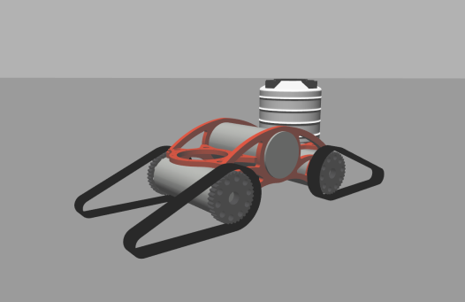

# ViV simulation
Packages for Gazebo simulation of the ViV UGV developed for the [HEKTOR](https://hektor.fer.hr/) project.

## Installation

### Dependencies
None
### Build

Clone into a catkin workspace and build with

	catkin build viv_gazebo

## Usage

### Launching simulation

To launch an empty world simulation

	roslaunch viv_gazebo viv_empty_world.launch  

### Control
ViV is spawned with a differential drive controller 

Velocity is commanded by publishing a Twist message to 
   
    /viv/velocity_controller/cmd_vel
