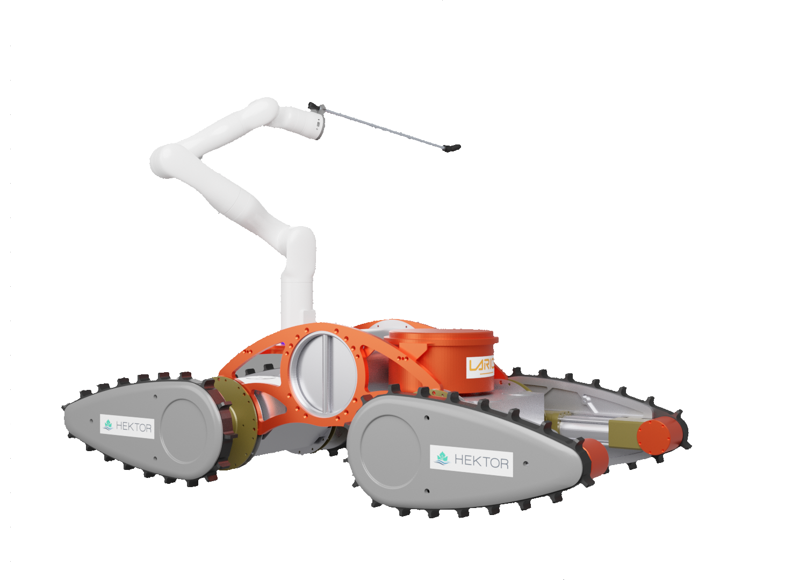

# ViV useful commands

## First terminal (ViV)
ssh

    ssh viv@VIV.local

to restart viv_base

    killall -9 rosmaster

    roslaunch viv_base viv_base.launch
    roslaunch viv_base viv_sensors.launch
    rosrun mavros mavsys -n viv/mavros rate --all 50

Now you should be able to drive around with a joystick

If viv_base breaks down check the can connection:

    ip -s -c -h a

See if can0 is UP or DOWN 

If its UP run:

    sudo ip link set can0 down 

If its DOWN, run:

    sudo ip link set can0 up type can bitrate 125000  

### For bagging
saves bags in ~/.ros folder!!!

    roslaunch viv_base viv_bag.launch

## Second terminal (local)
Remote master

    export ROS_MASTER_URI=http://VIV.local:11311

